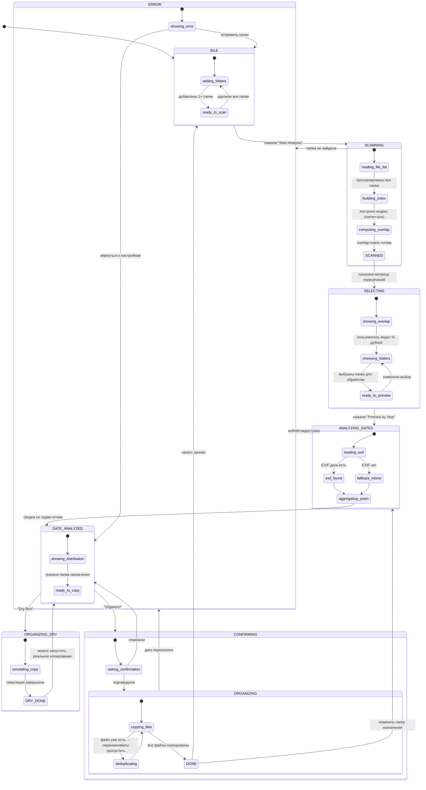
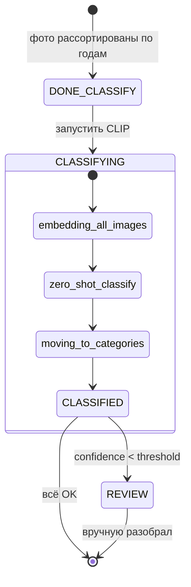

# Photo Sorter — автомат состояний

## Легенда переходов

| Из | В | Условие |
|----|----|---------|
| `IDLE` | `SCANNING` | Есть папки, нажата кнопка |
| `SCANNING` | `SCANNED` | Индекс построен, overlap посчитан |
| `SCANNED` | `SELECTING` | Матрица показана пользователю |
| `SELECTING` | `ANALYZING_DATES` | Выбраны папки → «Preview by Year» |
| `ANALYZING_DATES` | `DATE_ANALYZED` | EXIF/mtime прочитаны, года агрегированы |
| `DATE_ANALYZED` | `ORGANIZING_DRY` | «Dry Run» |
| `DATE_ANALYZED` | `CONFIRMING` | «Organize!» |
| `CONFIRMING` | `ORGANIZING` | Подтвердил |
| `ORGANIZING_DRY` | `DATE_ANALYZED` | Сухой прогон показал результат |
| `ORGANIZING` | `DONE` | Все файлы скопированы |
| `DONE` | `IDLE` | «Начать заново» |
| `DONE` | `ANALYZING_DATES` | Сменить папку назначения |
| Любой `-->` | `ERROR` | Ошибка (нет папки, нет прав, нет места) |

## Что можно доработать потом

